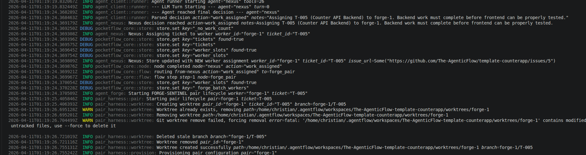
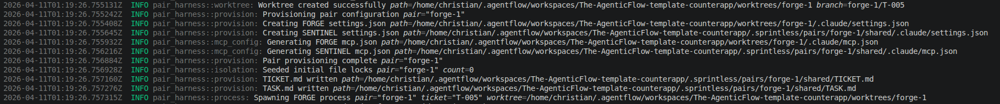
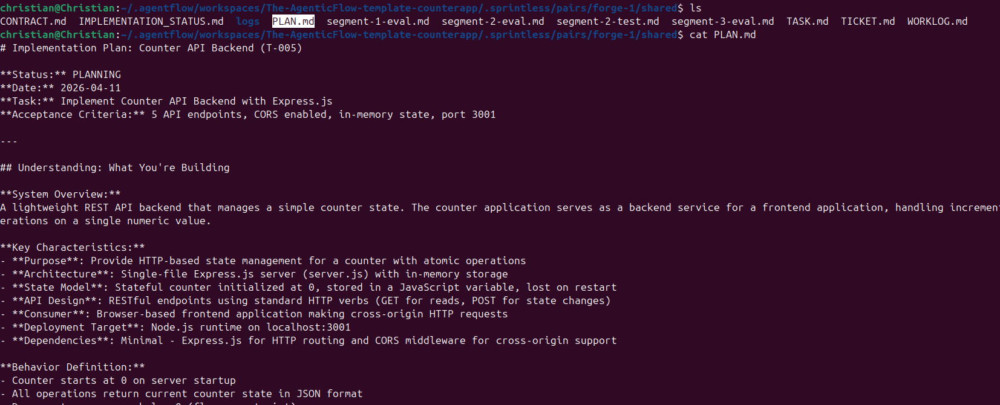
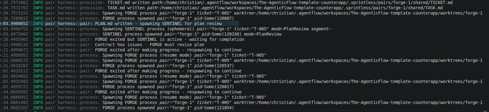
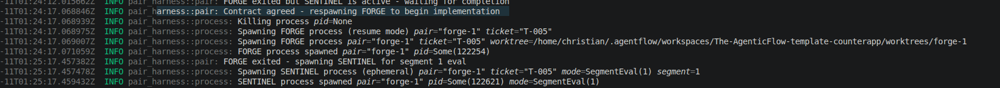
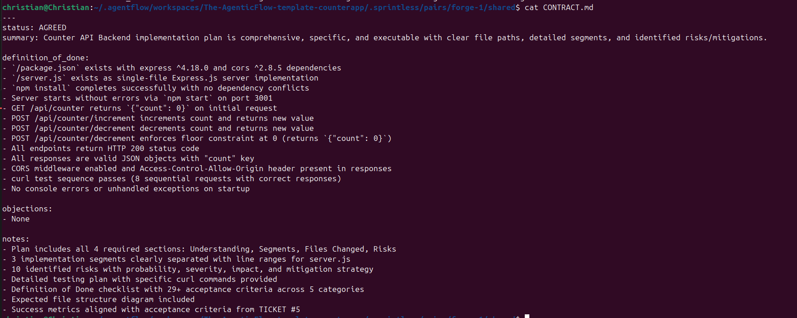
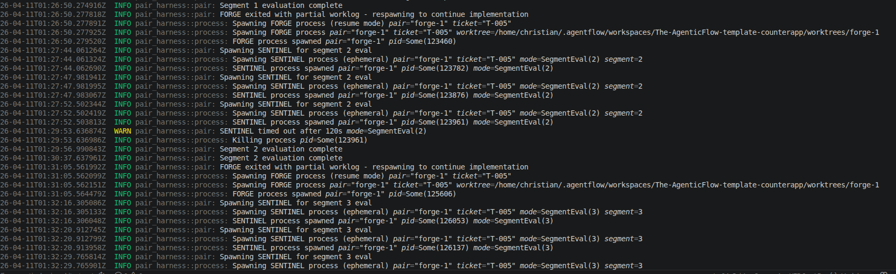
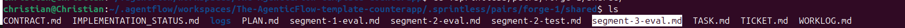
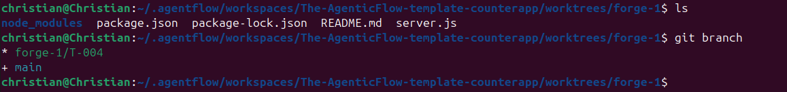

# Walkthrough: Running the Autonomous Flow

This guide walks you through a live run of AgentFlow so you can see exactly what happens at each stage. It is intended for new contributors who want to understand the orchestration before diving into code.

## Prerequisites

Before running, make sure you have completed the setup in [CONTRIBUTING.md](../CONTRIBUTING.md):

- Rust toolchain installed
- `.env` configured with `GITHUB_PERSONAL_ACCESS_TOKEN`, `GITHUB_REPOSITORY`, and at least one LLM provider key
- Claude Code CLI installed and `CLAUDE_PATH` set in `.env`
- Your target repository has at least one open GitHub issue

## Starting the Flow

```bash
cargo run --bin real_test
```

This starts the orchestration loop. The binary initialises the shared store, clones/updates the target repository workspace, and begins the NEXUS → FORGE-SENTINEL cycle.

## What Happens: Step by Step

### Step 1 — System Initialisation

On startup, the binary loads your `.env`, validates that required variables are set, and prepares the workspace under `~/.agentflow/workspaces/<owner>-<repo>/`.

The shared store is seeded with empty ticket and worker-slot collections. NEXUS takes over from here.



### Step 2 — NEXUS Discovers and Assigns Work

NEXUS performs two tasks automatically:

1. **Issue sync** — Calls the GitHub API to fetch open issues from the target repository and converts each into an internal ticket (e.g. `T-005` for issue #5).
2. **Work assignment** — Examines available worker slots from the registry and assigns the highest-priority ticket to an idle worker (e.g. `forge-1`).

You will see log lines like:

```
INFO agent_nexus: Synced new ticket from GitHub issue  ticket_id="T-005"
INFO agent_nexus: Nexus: Assigning ticket to worker   worker_id="forge-1" ticket_id="T-005"
```



### Step 3 — Worktree and Harness Setup

For each assigned worker, the `ForgePairNode` creates an isolated environment:

- **Git worktree** — A separate working copy at `~/.agentflow/workspaces/<owner>-<repo>/worktrees/forge-1/` on its own branch (`forge-1/T-005`). This lets multiple workers operate independently without conflicts.
- **Shared directory** — A `orchestration/pairs/forge-1/shared/` directory where FORGE and SENTINEL communicate through files. This is the heart of the pair harness.

```
workspace/
├── worktrees/
│   └── forge-1/          ← FORGE works here (isolated git worktree)
│       ├── src/           ← Actual code changes happen here
│       └── .claude/       ← Claude Code settings for FORGE
└── orchestration/
    └── pairs/
        └── forge-1/
            └── shared/    ← Communication channel between FORGE ↔ SENTINEL
                ├── TICKET.md
                ├── TASK.md
                ├── PLAN.md
                ├── CONTRACT.md
                ├── WORKLOG.md
                ├── segment-N-eval.md
                ├── final-review.md
                └── STATUS.json
```



### Step 4 — FORGE Writes a Plan

The harness spawns a Claude Code process (FORGE) which reads the ticket and writes a `PLAN.md` to the shared directory. The plan breaks the work into numbered segments.

Log line you will see:

```
INFO pair_harness::pair: PLAN.md written - spawning SENTINEL for plan review
```



### Step 5 — SENTINEL Reviews the Plan

The harness spawns a second ephemeral Claude Code process (SENTINEL) to review the plan. SENTINEL evaluates the plan and either:

- **AGREED** → Writes `CONTRACT.md` with the agreed scope and segment definitions. The harness respawns FORGE to begin implementation.
- **CHANGES_REQUESTED** → Writes `CONTRACT.md` with requested changes. FORGE must revise `PLAN.md` and re-submit.

This loop continues until SENTINEL and FORGE reach agreement.

```
INFO pair_harness::pair: Contract agreed - respawning FORGE to begin implementation
```

If the plan has issues, SENTINEL requests revisions:



### Step 6 — FORGE Implements Segment by Segment

With an agreed contract, FORGE implements the work one segment at a time. After each segment:

1. FORGE commits the code changes in the worktree.
2. FORGE updates `WORKLOG.md` with segment progress.
3. The harness detects the `WORKLOG.md` update and spawns SENTINEL for a **segment evaluation**.

```
INFO pair_harness::pair: Spawning SENTINEL for segment 1 eval
```




### Step 7 — SENTINEL Evaluates Each Segment

For each completed segment, SENTINEL writes a `segment-N-eval.md` file with either `APPROVED` or `CHANGES_REQUESTED`. If changes are requested, FORGE must fix the issues before moving on.

You can inspect these evaluation files in the shared directory to see exactly what SENTINEL flagged:







### Step 8 — Final Review and PR Creation

Once all segments are approved:

1. The harness spawns SENTINEL for a **final review** (`final-review.md`).
2. If the final verdict is `APPROVED`, FORGE is respawned one last time to push the branch and open a pull request.
3. FORGE writes `STATUS.json` with `"status": "PR_OPENED"` and the PR URL.
4. The pair lifecycle completes and control returns to NEXUS.

```
INFO pair_harness::pair: Final review APPROVED - respawning FORGE to create PR
INFO agent_forge: Ticket completed  ticket="T-005" pr_url="https://github.com/.../pull/6"
```

The resulting PR contains all the committed changes from the worktree, e.g.:  
https://github.com/The-AgenticFlow/template-counterapp/pull/6

## Communication File Reference

The shared directory is how FORGE and SENTINEL communicate. Here is what each file means:

| File | Written by | Purpose |
|------|-----------|---------|
| `TICKET.md` | Harness | The original GitHub issue content |
| `TASK.md` | Harness | High-level task instructions |
| `PLAN.md` | FORGE | Detailed implementation plan with segment breakdown |
| `CONTRACT.md` | SENTINEL | Agreement or requested changes on the plan |
| `WORKLOG.md` | FORGE | Running log of segment implementation progress |
| `segment-N-eval.md` | SENTINEL | Evaluation result for segment N (APPROVED / CHANGES_REQUESTED) |
| `final-review.md` | SENTINEL | Final overall review verdict |
| `STATUS.json` | FORGE | Terminal status: `PR_OPENED`, `BLOCKED`, or `FUEL_EXHAUSTED` |

## Monitoring Tips

- **Watch logs in real time**: The orchestration logs are verbose by default. Key prefixes to watch:
  - `agent_nexus` — orchestration decisions
  - `pair_harness::pair` — lifecycle transitions
  - `pair_harness::process` — process spawn/exit events
- **Inspect the shared directory**: `ls ~/.agentflow/workspaces/<repo>/orchestration/pairs/forge-1/shared/` shows you exactly where the pair is in the lifecycle.
- **Check worktree diffs**: `git -C ~/.agentflow/workspaces/<repo>/worktrees/forge-1 log --oneline` shows what FORGE has committed.

## Troubleshooting

| Symptom | Likely Cause | Fix |
|---------|-------------|-----|
| `Failed to spawn FORGE process` | Claude CLI not found | Set `CLAUDE_PATH` in `.env` to the absolute path |
| `EOF while parsing a value at line 1 column 0` | Race condition on `STATUS.json` | Fixed in current main; pull latest |
| `FORGE startup timeout` | PLAN.md not written within 5 min | Check Claude CLI auth (`claude auth login`) |
| `Pair stalled` | No WORKLOG update for too long | FORGE may be stuck; check worktree state |
| `Maximum context resets exceeded` | FORGE-SENTINEL disagreement loop | Inspect CONTRACT.md and segment evals for the conflict |
