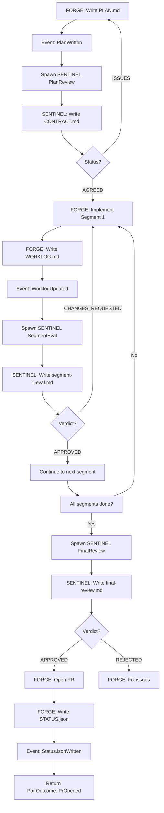

# FORGE-SENTINEL Pair Harness Integration

## Overview

The `ForgePairNode` integrates the full event-driven FORGE-SENTINEL lifecycle into the PocketFlow workflow engine.

**Note:** This implementation uses **filesystem-based state** by default, eliminating the need for Redis. State is stored in the shared directory at `orchestration/pairs/{pair-id}/{ticket-id}/shared/state.json`.

## Architecture

### Component Relationship

```
PocketFlow (Workflow Engine)
    ↓
ForgePairNode (BatchNode)
    ↓
ForgeSentinelPair (Event-Driven Harness)
    ↓
├── FORGE (Long-Running Process)
├── SENTINEL (Ephemeral Evaluator)
└── SharedDirWatcher (inotify/FSEvents)
```

### Key Components

| Component | Location | Purpose |
|-----------|----------|---------|
| `ForgePairNode` | [`crates/agent-forge/src/lib.rs`](../crates/agent-forge/src/lib.rs) | PocketFlow integration |
| `ForgeSentinelPair` | [`crates/pair-harness/src/pair.rs`](../crates/pair-harness/src/pair.rs) | Lifecycle orchestrator |
| `SharedDirWatcher` | [`crates/pair-harness/src/watcher.rs`](../crates/pair-harness/src/watcher.rs) | Event detection |
| `ProcessManager` | [`crates/pair-harness/src/process.rs`](../crates/pair-harness/src/process.rs) | Process spawning |
| `SentinelNode` | [`crates/agent-sentinel/src/lib.rs`](../crates/agent-sentinel/src/lib.rs) | Code review evaluator |

## Comparison: ForgeNode vs ForgePairNode

### ForgeNode (Old - Simplified)

```rust
pub struct ForgeNode {
    pub workspace_root: PathBuf,
    pub persona_path: PathBuf,
}
```

**Flow:**
1. Create worktree
2. Spawn Claude Code (FORGE) as one-shot process
3. Wait for process exit
4. Read STATUS.json
5. Return outcome

**Limitations:**
- ❌ No SENTINEL review
- ❌ No event-driven architecture
- ❌ No context reset support
- ❌ Polls for STATUS.json
- ❌ One-shot execution model

### ForgePairNode (New - Event-Driven)

```rust
pub struct ForgePairNode {
    pub workspace_root: PathBuf,
    pub github_token: String,
}
```

**Note:** No Redis required - uses filesystem-based state stored in the shared directory.

**Flow:**
1. Create `PairConfig` and `Ticket`
2. Instantiate `ForgeSentinelPair`
3. Run event-driven lifecycle:
   - FORGE writes PLAN.md → SENTINEL reviews → CONTRACT.md
   - FORGE implements segment → writes WORKLOG.md
   - SENTINEL evaluates → writes segment-N-eval.md
   - Repeat for all segments
   - SENTINEL final review → final-review.md
   - FORGE opens PR → writes STATUS.json
4. Handle context resets via HANDOFF.md
5. Return `PairOutcome`

**Advantages:**
- ✅ Full SENTINEL review lifecycle
- ✅ Event-driven (inotify/FSEvents)
- ✅ Automatic context resets
- ✅ Long-running FORGE process
- ✅ Ephemeral SENTINEL spawns

## Usage in PocketFlow

### Basic Integration

```rust
use agent_forge::ForgePairNode;
use pocketflow_core::{Flow, BatchNode};

// Create the node (no Redis required)
let forge_pair = ForgePairNode::new(
    "/path/to/workspace",
    "ghp_your_github_token",
);

// Add to flow
let mut flow = Flow::new("my_flow");
flow.add_node(Box::new(forge_pair));
```

### Outcome Handling

The node returns outcomes mapped to worker status:

| `PairOutcome` | Worker Status | Description |
|---------------|---------------|-------------|
| `PrOpened` | `Done` | PR successfully opened |
| `Blocked` | `Suspended` | Needs human intervention (includes actual error detail) |
| `FuelExhausted` | `Idle` | Max resets exceeded |

**Note on blocked reasons:** When a push fails, the blocked reason contains the actual error from GitHub (e.g., `"Push rejected: secrets detected in git history — GH013: ..."`) rather than the generic `"needs push/PR creation"`. This allows NEXUS to make informed decisions instead of blindly re-approving the same failing action.

### Configuration

The `PairConfig` is automatically created with:

```rust
PairConfig {
    pair_id: worker_id,          // e.g., "forge-1"
    worktree: workspace_root/worktrees/forge-1/,
    shared: workspace_root/orchestration/pairs/forge-1/T-42/shared/,
    redis_url: "redis://localhost:6379",
    github_token: "ghp_...",
    max_resets: 10,              // Default
    watchdog_timeout_secs: 1200, // 20 minutes
}
```

## Event-Driven Lifecycle

### Filesystem Events

The `SharedDirWatcher` monitors the shared directory for:

| File | Event | Action |
|------|-------|--------|
| `PLAN.md` | Written | Spawn SENTINEL for plan review (skipped if `plan_approved`) |
| `CONTRACT.md` | Written | Resume FORGE (if AGREED) |
| `WORKLOG.md` | Modified | Spawn SENTINEL for segment eval (skipped if `final_approved`) |
| `segment-N-eval.md` | Written | Resume FORGE |
| `final-review.md` | Written | Resume FORGE (if APPROVED) |
| `STATUS.json` | Written | Terminal state - return outcome |
| `HANDOFF.md` | Written | Kill FORGE, respawn fresh |

### Review Cycle



## Context Resets

When FORGE exhausts its context window:

1. FORGE writes `HANDOFF.md` with current state
2. Event: `HandoffWritten`
3. Harness kills FORGE process
4. Harness spawns fresh FORGE with HANDOFF.md context
5. FORGE resumes from checkpoint

**Reset Limit:** Configurable via `PairConfig.max_resets` (default: 10)

## Thread Safety

The `ForgePairNode` spawns the pair lifecycle in a `spawn_blocking` task because:

- `SharedDirWatcher` uses `std::sync::mpsc::Receiver` (not `Send + Sync`)
- The event loop is synchronous with timeout-based polling
- The pair lifecycle needs a dedicated runtime

```rust
let outcome = tokio::task::spawn_blocking(move || {
    let rt = tokio::runtime::Runtime::new()?;
    rt.block_on(async move {
        let mut pair = ForgeSentinelPair::new(config);
        pair.run(&ticket).await
    })
})
.await??;
```

## Testing

### Unit Test

```rust
#[tokio::test]
async fn test_forge_pair_node() {
    let workspace = tempdir().unwrap();
    let node = ForgePairNode::new(
        workspace.path(),
        "ghp_test_token",
    );
    
    let slot = WorkerSlot {
        id: "forge-1".to_string(),
        status: WorkerStatus::Assigned {
            ticket_id: "T-123".to_string(),
            issue_url: Some("https://github.com/owner/repo/issues/123".to_string()),
        },
    };
    
    let result = node.exec_one(json!(slot)).await.unwrap();
    assert_eq!(result["outcome"], "pr_opened");
}
```

### E2E Test

See [`crates/pair-harness/tests/full_e2e.rs`](../crates/pair-harness/tests/full_e2e.rs) for full lifecycle testing.

## Migration Guide

### From ForgeNode to ForgePairNode

1. **Update imports:**
   ```rust
   // Old
   use agent_forge::ForgeNode;
   
   // New
   use agent_forge::ForgePairNode;
   ```

2. **Update construction:**
   ```rust
   // Old
   let forge = ForgeNode::new(workspace_root, persona_path);
   
   // New (no Redis required)
   let forge = ForgePairNode::new(
       workspace_root,
       github_token,
   );
   ```

3. **Update flow:**
   - No changes needed - same `BatchNode` interface
   - Returns same action types: `pr_opened`, `suspended`, `failed`

4. **Update configuration:**
   - Add GitHub token to environment
   - Ensure `orchestration/pairs/` directory exists
   - No Redis setup required

### Benefits of Migration

| Aspect | Improvement |
|--------|-------------|
| Code Quality | SENTINEL reviews every segment |
| Reliability | Automatic retries on CHANGES_REQUESTED |
| Efficiency | Zero-polling event detection |
| Scalability | Long-running process model |
| Observability | Detailed segment evaluations |

## CI Fix and Conflict Rework Cycles

When VESSEL detects CI failures on a PR, it writes `CI_FIX.md` to the pair's shared directory and routes back to the forge pair. Similarly, merge conflicts with origin/main trigger a `CONFLICT_RESOLUTION.md` rework cycle. These are **rework cycles**, not fresh implementations.

### Rework Prompt Priority

The FORGE prompt builder (`build_forge_prompt`) checks for rework markers **before** CONTRACT.md:

```
CI_FIX.md or CONFLICT_RESOLUTION.md exists?
  → YES: generate rework_prompt() — focused on fixing the specific failure
  → NO:  fall through to CONTRACT.md / HANDOFF.md / new session logic
```

Without this priority check, FORGE would see CONTRACT.md with `status: AGREED` and re-enter the normal segment implementation workflow, ignoring the CI fix instructions in TASK.md entirely — resulting in the same code being pushed to the same PR with no actual fix.

### Lifecycle Flags

When CI_FIX.md or CONFLICT_RESOLUTION.md is detected at lifecycle start:

- `plan_approved = true` — skip SENTINEL plan review
- `final_approved = true` — skip SENTINEL final review and segment evaluations

This prevents the event loop from redundantly spawning SENTINEL for reviews that are already complete. The `FsEvent::WorklogUpdated` handler explicitly checks `final_approved` before spawning SENTINEL for segment or final review.

### FORGE Exit Handling

When FORGE exits during a rework cycle with `final_approved = true` and all segments already approved, the harness respawns FORGE to continue the rework rather than falling through with no action (which would cause a stall).

### Key Properties

- FORGE pushes fixes to the **existing PR branch** — it does NOT create a new PR
- The TASK.md instructions explicitly state: "If a PR already exists for this branch, do NOT create a new one — just push and update STATUS.json"
- origin/main is merged into the worktree before FORGE is spawned, so FORGE has the latest CI workflow files
- WORKLOG.md is reset on re-provision so the watchdog doesn't see a stale mtime from the previous lifecycle

## Push Error Recovery

When FORGE completes work but the pair exits without a PR (e.g., `PairOutcome::Blocked` with reason "needs push/PR creation"), `ForgePairNode` attempts to push and create the PR itself. This flow now handles errors intelligently:

### Secret Scanning Rejection (GH013)

The protection is **generic** — it covers any file in the worktree that contains secrets, not just `.claude/`:

```
git push → rejected: GH013 "Push cannot contain secrets"
  (e.g., any file containing a GitHub PAT, AWS key, etc.)
↓
scan_and_scrub_secrets():
  - Recursively scan ALL text files in worktree for known secret patterns
  - Replace literal values with placeholders
  - Dynamically add directories with secrets to .gitignore
↓
git_add_safe():
  - untrack_secret_containing_files(): check all git ls-files for secrets
  - git rm --cached <any-secret-file> (not just .claude/)
  - git add -A
↓
Commit scrubbed state
↓
rewrite_secret_commits():
  - list_secret_containing_tracked_files(): find ALL tracked files with secrets
  - git filter-branch to remove them from history
↓
Retry push
↓
Success → continue to PR creation
Failure → blocked with full error detail
```

### Non-Fast-Forward Rejection

Only genuine non-fast-forward rejections trigger `--force-with-lease`. Secret scanning rejections are never force-pushed.

### Generic Push Failure

The worker is immediately blocked with the full stderr in the reason string.

### Key Code References

| Function | Location | Purpose |
|----------|----------|---------|
| `scan_and_scrub_secrets()` | `agent-forge/src/lib.rs` | Recursively scan all text files in worktree for secrets |
| `scan_dir_for_secrets()` | `agent-forge/src/lib.rs` | Recursive directory walker with skip-list |
| `redact_patterns()` | `agent-forge/src/lib.rs` | Regex-based secret pattern matching |
| `contains_secrets()` | `agent-forge/src/lib.rs` | Lightweight check (same patterns, no modification) |
| `git_add_safe()` | `agent-forge/src/lib.rs` | Untrack secret-containing files then git add -A |
| `untrack_secret_containing_files()` | `agent-forge/src/lib.rs` | Check all tracked files for secrets and untrack |
| `rewrite_secret_commits()` | `agent-forge/src/lib.rs` | Remove all secret-containing files from git history |
| `list_secret_containing_tracked_files()` | `agent-forge/src/lib.rs` | Find all tracked files that contain secrets |
| `ensure_exclusions()` | `agent-forge/src/lib.rs` | Dynamically add directories to .gitignore |
| `ensure_worktree_gitignore()` | `pair-harness/src/provision.rs` | Add known credential dirs (.claude/) to worktree .gitignore |

## Future Enhancements

- [x] **Secret Protection**: Scrub secrets before push, rewrite history on GH013, accurate blocked reasons
- [ ] **Parallel Segment Evaluation**: Evaluate multiple segments concurrently
- [ ] **Smart Checkpointing**: More granular HANDOFF.md state
- [ ] **Dynamic Watchdog**: Adjust timeout based on segment complexity
- [ ] **Review Metrics**: Track SENTINEL approval rates
- [ ] **Adaptive Resets**: Learn optimal reset thresholds per project

## References

- [FORGE-SENTINEL Architecture](./forge-sentinel-arch.md)
- [Pair Harness Crate](../crates/pair-harness/)
- [PocketFlow Core](../crates/pocketflow-core/)
